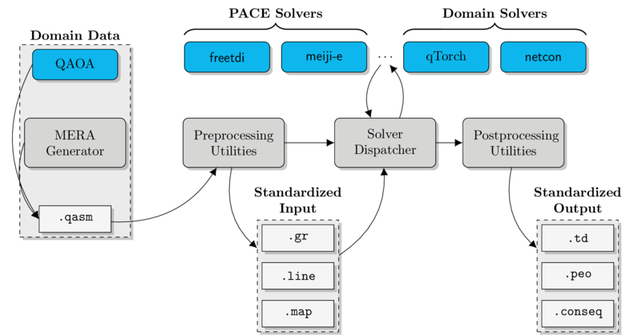

# `ConSequences` Codebase
## Overview

|   |
|---|
| **Figure**: ConSequences Code Pipeline. Code is represented with rounded corners and data with sharp corners. Code blocks are further split into Docker (blue) and Python (gray).|

ConSequences is primarily a pipeline of Python code used to pre- and post-process data, along with a dispatcher for calling contraction sequence algorithms wrapped in Docker images.
In this README we overview how to install the software, and how to run it with various use cases.

## Installation (General)

This codebase requires Python 3 and Docker.

In general, we recommend wrangling Python dependencies using an environment like `virtualenv`; see below for example instructions for installing on Ubuntu 18.04, and refer to the [virtualenv docs](https://virtualenv.pypa.io/en/stable/) page for more information.
Regardless of whether a virtual environment is used or not, the Python requirements are included in `requirements.txt` and may be installed with `pip install -r requirements.txt`.

For stability, we recommend installing Docker Community Edition (CE) on the stable channel.
Detailed instructions for installing Docker CE can be found in the [docker docs](https://docs.docker.com/install/).

## Installation (Ubuntu 18.04)

_(This guide is current as of July 23, 2018)_


#### Python3 Setup
At time of writing, a fresh installation of Ubuntu 18.04 comes with `python3` already, but requires `pip3` to install the `virtualenv` virtual environment controller. Install it with

```bash
sudo apt-get install python3-pip
```

then install virtualenv:

```bash
pip3 install virtualenv
```

and finally initialize a new Python3 virtual environment:

```bash
virtualenv env -p python3
```

To activate this environment the from `consequences/` directory:

```bash
source env/bin/activate
```

You should now see `(env)` in the prefix of your terminal session. To deactivate the environment:

```
deactivate
```

The deactivation command can be run from any directory.

With the virtual environment activated, install the Python3 `ConSequences` dependencies by running:

```bash
pip -r requirements.txt
```

#### Docker-CE Setup

Docker-CE should be set up using the official [Docker Docs](https://docs.docker.com/install/linux/docker-ce/ubuntu/#install-docker-ce-1) installation guide. Follow it until you install docker-ce with the following command:

```bash
sudo apt-get install docker-ce
```

Natively, Docker must be run by root. Instead of typing `sudo` with every command, we instead follow the post-installation guidelines by creating a `docker` group for users who will be running docker images:

```bash
sudo groupadd docker
sudo usermod -aG docker $USER
```

After rebooting, run the following command to verify that Docker has been installed correctly:

```bash
docker run hello-world
```

## How to run

At its core, `ConSequences` is a framework for testing contraction sequence algorithms on a user-defined dataset of interest.
In this section we detail the algorithms provided and data formats supported natively, along with instructions for executing single runs and larger batch experiments from the command-line interface.


#### Provided algorithms

| Algorithm    | Description                    | Source Link                                       |
|--------------|--------------------------------|---------------------------------------------------|
| FreeTDI      | PACE 2017 winner               | https://github.com/freetdi/p17                    |
| Meiji        | PACE 2017 runner-up            | https://github.com/TCS-Meiji/PACE2017-TrackA      |
| netcon       | BFS-based from MERA literature | https://arxiv.org/abs/1304.6112                   |
| QuickBB      | Elimination-ordering--based    | http://www.hlt.utdallas.edu/~vgogate/quickbb.html |
| qTorch-Stoch | Heuristic provided in qTorch   | https://github.com/aspuru-guzik-group/qtorch      |

#### Supported data formats

_Description of provided data formats coming soon_

#### Running the command-line interface

_Description of CLI commands coming soon_

#### Running a batch experiment

_config file format coming soon_

## Templates for extension

_Python template for adding new input data types coming soon_

_Docker image template for adding new algorithms coming soon_
